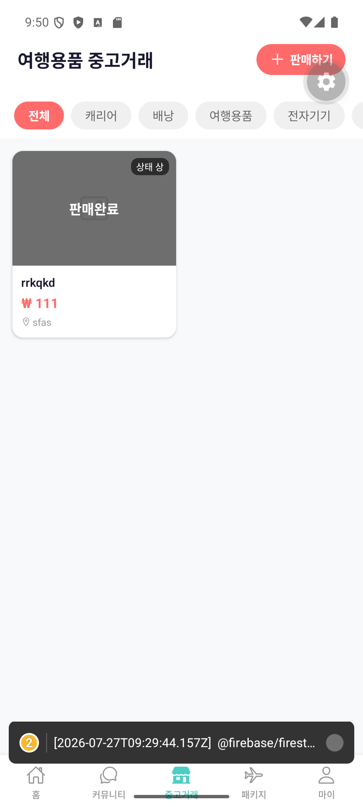
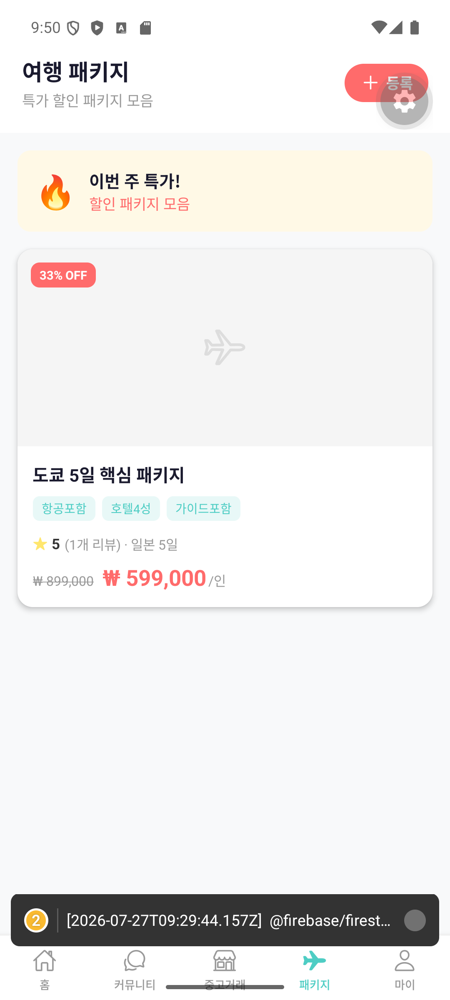

# 클로드와 첫 삽 뜨기 — 5개 탭짜리 앱 뼈대 만들기

앱을 만들기로 결심은 했는데, 막상 뭐부터 해야 할지 몰랐다.

개발자라면 아마 기획서부터 짜고, 화면 설계도를 그리고, DB 구조부터 잡았을 것이다. 나는 그런 걸 몰랐다. 그래서 그냥 클로드에게 있는 그대로 말했다.

"여행 커뮤니티 앱을 만들고 싶어요. 여행 팁을 나누고, 중고 여행용품도 거래하고, 여행 패키지도 팔 수 있는 앱이요."

그게 전부였다. 놀랍게도 거기서부터 뭔가가 시작됐다.

## 탭 5개, 그게 뼈대의 전부였다

클로드는 이 세 가지 기능을 하나의 앱 안에 담으려면 "탭 구조"가 필요하다고 알려줬다. 그렇게 나온 게 화면 아래쪽에 나란히 놓인 5개 탭이다.

```
┌─────────────────────────────────────────┐
│  홈 | 커뮤니티 | 중고거래 | 패키지 | 마이  │
└─────────────────────────────────────────┘
```

- **홈**: 인기 여행지, 최신 여행 팁, 환율 정보를 한눈에
- **커뮤니티**: 여행 팁을 올리고 좋아요 누르는 게시판
- **중고거래**: 여행 용품 중고 거래
- **패키지**: 여행 상품 목록
- **마이**: 내 프로필과 활동 내역

지금 실제로 앱을 켜면 이런 모습이다.

[스크린샷: 홈 화면 — 환율 배너, 인기 여행글, 최신 팁]


[스크린샷: 커뮤니티 게시글 목록]


[스크린샷: 중고거래 상품 목록]


[스크린샷: 여행 패키지 목록]


처음엔 이 화면들 안의 데이터가 전부 가짜였다. 진짜 서버도, 진짜 회원가입도 없이 화면에 하드코딩된 글 몇 개, 상품 몇 개가 전부였다. 그런데도 신기했다. "탭을 누르면 화면이 바뀐다"는 그 당연한 걸 내가 직접 만들었다는 게.

## "이거 이상해요"의 반복

이 단계에서 배운 게 하나 있다면, 나는 코드를 한 줄도 안 썼지만 대신 이걸 계속 반복했다는 것이다.

1. 클로드가 화면을 만들어준다
2. 에뮬레이터(가상 스마트폰 화면)에서 직접 눌러본다
3. "여기 버튼이 안 눌려요" 혹은 "이 화면 레이아웃이 이상해요"라고 말한다
4. 클로드가 고친다
5. 다시 눌러본다

실제로 4단계에서 안드로이드 특유의 레이아웃 버그도 만났다. 커뮤니티 화면 상단 카테고리 칩(전체/환전정보/여행팁/여행스토리 같은 동그란 버튼들)이 화면 크기에 따라 위아래로 이상하게 겹치는 문제였다. 원인은 가로 스크롤 영역에 여백을 주는 방식이 안드로이드에서 특이하게 동작해서였는데, 나는 원인은 몰라도 "이 버튼들이 화면을 가린다"는 증상만 말했고, 클로드가 원인을 찾아 고쳤다.

이게 이 시리즈 전체에서 반복될 패턴이다. **나는 증상을 말하고, AI가 원인을 찾는다.** 코딩을 몰라도 이 정도는 할 수 있었다.

다음 화에서는 이 예쁜 뼈대에 진짜 알맹이를 채우는 이야기 — 로그인 버튼 하나 만드는 데 생각보다 훨씬 많은 게 필요했던 사연을 풀어보겠다.

---

*(이전 화: [1화. 프롤로그](./1화_프롤로그.md)) · (다음 화: 3화. 회원가입 버튼 하나에도 이렇게 많은 게 필요하다니)*
