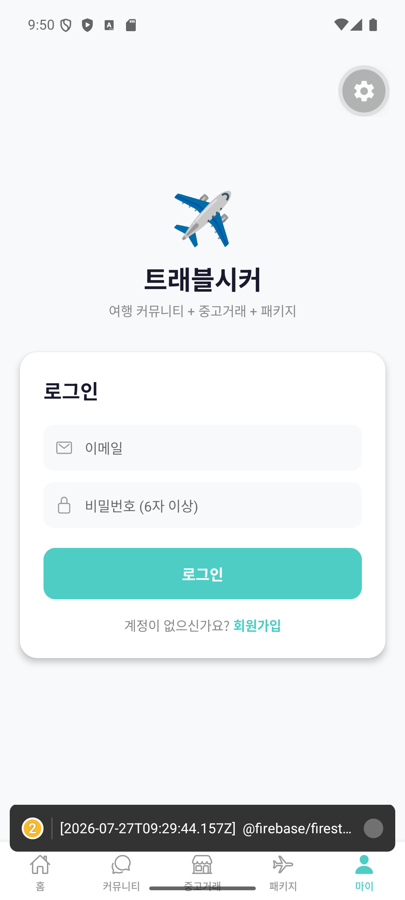
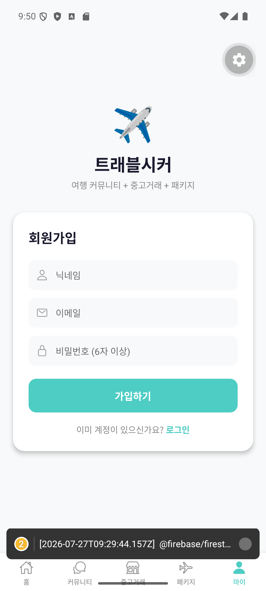
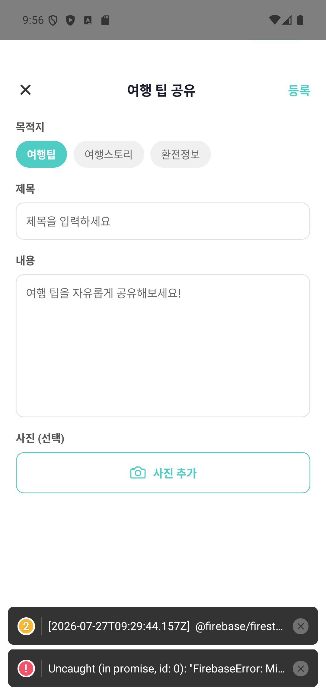

# 회원가입 버튼 하나에도 이렇게 많은 게 필요하다니

앱 뼈대를 세우고 나서 다음 목표는 단순했다. "로그인이 되게 하자."

그런데 클로드와 대화하면서 알게 된 사실 — 로그인 버튼 하나를 진짜로 작동하게 만들려면 뒤에서 훨씬 많은 게 필요했다.

- 사용자 정보를 어딘가에 저장할 곳 (회원 데이터베이스)
- 비밀번호를 안전하게 확인하는 방법 (인증 시스템)
- 로그인한 사람만 글을 쓸 수 있게 막는 규칙
- 사진을 올리면 저장할 서버 공간

이걸 전부 처음부터 만들려면 서버 개발자를 따로 고용해야 할 판이었다. 그런데 클로드가 제안한 건 **Firebase**였다. 구글이 만든 서비스로, 회원 관리·데이터 저장·사진 저장까지 알아서 해주는 도구라고 했다. 나는 구글 계정으로 Firebase 콘솔에 들어가서 프로젝트 하나를 만든 게 전부였다. 나머지 연결 작업은 클로드가 코드로 처리했다.

## 이메일 하나로 회원가입이 되기까지

며칠 뒤, 실제로 작동하는 로그인/회원가입 화면이 나왔다.

[스크린샷: 로그인 화면]

[스크린샷: 회원가입 화면]

이 화면 뒤에서 벌어지는 일은 이랬다.

1. 닉네임, 이메일, 비밀번호를 입력하고 "가입하기"를 누른다
2. Firebase 인증 시스템이 이메일/비밀번호를 등록한다
3. 동시에 데이터베이스(Firestore)에 내 프로필 정보(닉네임, 가입일 등)가 저장된다
4. 다음부터는 이메일/비밀번호로 로그인하면 내 정보를 그대로 불러온다

말로 쓰면 네 줄이지만, 처음 테스트할 때는 당연히 한 번에 되지 않았다. 회원가입은 됐는데 로그인이 안 되거나, 로그인은 됐는데 내 닉네임이 화면에 안 뜨는 식의 자잘한 문제들이 계속 나왔다. 그때마다 "회원가입은 됐는데 마이페이지에 이메일만 뜨고 닉네임이 안 나와요" 같은 식으로 증상을 설명하면, 클로드가 코드 어디가 문제인지 찾아 고치는 과정을 반복했다.

## 사진 업로드, 그리고 실시간이라는 마법

로그인이 되고 나니 그다음은 "글쓰기"였다. 커뮤니티에 글을 쓰고 사진을 첨부하는 기능도 이 시기에 붙었다.

[스크린샷: 여행 팁 글쓰기 화면]

사진 업로드는 이렇게 동작한다: 갤러리에서 사진을 고르면 Firebase Storage(사진 보관함)에 업로드되고, 그 사진의 인터넷 주소(URL)만 게시글 정보와 함께 저장된다. 사진 자체를 통째로 들고 다니는 게 아니라 "이 주소에 사진이 있다"는 표지판만 저장하는 방식이라고 이해하니 훨씬 납득이 됐다.

그리고 가장 신기했던 건 **실시간 반영**이었다. 내가 글을 쓰면 새로고침을 하지 않아도 커뮤니티 목록에 바로 나타났다. 이것도 Firestore의 "실시간 리스너"라는 기능 덕분이라고 하는데, 정확한 원리는 지금도 다 이해하진 못한다. 다만 체감한 건 확실했다. 화면을 새로고침할 필요가 없는 앱이 "진짜 앱"처럼 느껴지기 시작했다는 것.

이 단계를 지나면서 회원가입, 로그인, 글쓰기, 사진 업로드, 실시간 목록 — 다섯 가지가 전부 실제로 작동하는 걸 확인했다. 코딩을 하나도 모르는 사람이 만들었다고는 믿기지 않을 정도였다.

다음 화에서는 좋아요, 댓글, 채팅처럼 사람 냄새 나는 기능들을 채워나간 이야기를 해보겠다.

---

*(이전 화: [2화. 클로드와 첫 삽 뜨기](./2화_첫_삽_뜨기.md)) · (다음 화: 4화. 좋아요, 댓글, 채팅 — 진짜 앱처럼 만들기)*
