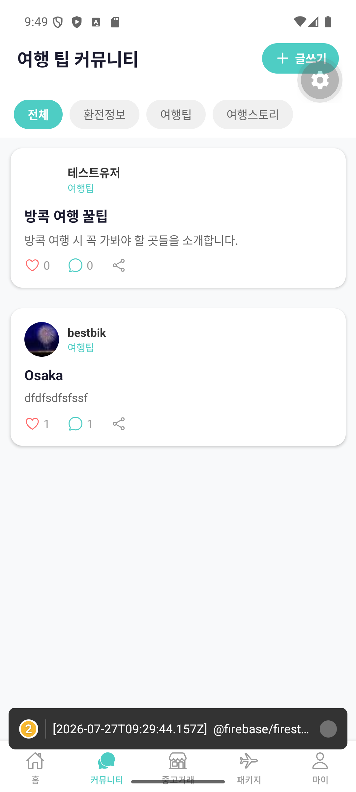
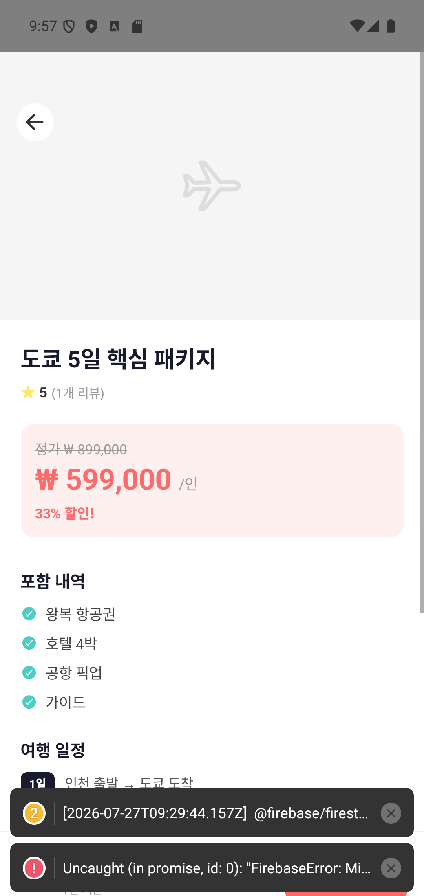
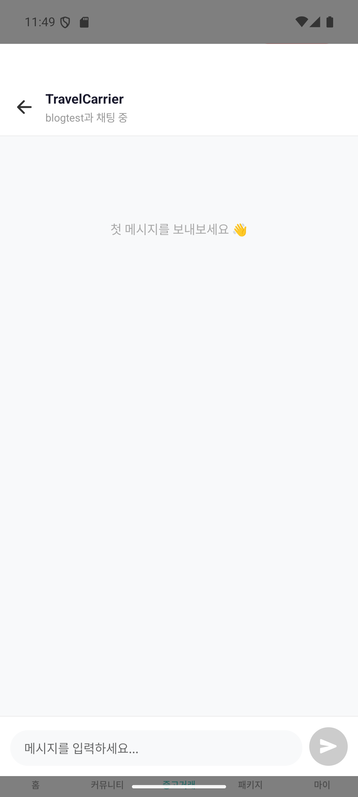

# 좋아요, 댓글, 채팅 — 진짜 앱처럼 만들기

로그인도 되고 글도 써지니, 이제 이 앱이 "게시판"에서 "커뮤니티"로 넘어갈 차례였다. 사람들이 서로 반응하고 대화할 수 있어야 진짜 커뮤니티다.

## 좋아요, 생각보다 까다로웠다

가장 만만해 보였던 기능이 사실 제일 먼저 말썽을 일으켰다. 좋아요 버튼을 누르면 숫자가 올라가는 건 금방 됐는데, 문제는 **앱을 껐다 켜면 좋아요가 초기화되고, 같은 글에 좋아요를 여러 번 누를 수 있다**는 것이었다.

원인은 단순했다. 처음엔 그냥 "좋아요 개수"만 숫자로 저장했기 때문에, 누가 이미 눌렀는지 기록이 없었던 것. 해결책은 "이 글에 좋아요를 누른 사람 목록"을 따로 저장하는 것이었다. 내 아이디가 그 목록에 있으면 좋아요 취소, 없으면 좋아요 추가 — 이렇게 바뀌고 나서야 새로고침해도, 앱을 껐다 켜도 상태가 유지됐다.

[스크린샷: 커뮤니티 목록 — 좋아요/댓글 수 표시]

## 댓글, 그리고 패키지 리뷰 별점

댓글 기능도 비슷한 시기에 들어갔다. 게시글 하나에 댓글이 여러 개 달릴 수 있어야 해서, 게시글과는 별도로 "이 글의 댓글들"을 담는 공간을 만들었다. 댓글을 달면 +1, 지우면 -1 하는 식으로 댓글 수도 같이 관리했다.

여행 패키지 쪽에는 별점 리뷰를 붙였다. 별 1~5개를 매기고 텍스트 후기를 남기면, 그 패키지의 평균 별점이 자동으로 다시 계산된다.

[스크린샷: 패키지 상세 — 별점/리뷰 수 표시]

여기서도 "중복 방지"가 은근히 신경 쓰이는 부분이었다. 한 사람이 같은 패키지에 리뷰를 열 번 남기면 평점이 왜곡되니까, 이미 리뷰를 남겼는지 먼저 확인하고 막는 로직이 필요했다. 나는 "한 사람이 리뷰 여러 개 못 남기게 해주세요"라고만 말했고, 실제로 어떻게 막을지는 클로드가 설계했다.

## 채팅, 제일 신기했던 기능

개인적으로 가장 신기했던 건 **1:1 채팅**이었다. 중고거래 상품에 관심이 생기면 판매자와 실시간으로 대화할 수 있게 만들었는데, 채팅방을 어떻게 구분하는지가 재밌었다.

채팅방 하나하나에는 "구매자 아이디 + 판매자 아이디 + 상품 아이디"를 조합한 고유 번호가 붙는다. 그래서 같은 두 사람이 다른 상품으로 다시 채팅해도 방이 헷갈리지 않고, 내가 이미 문의했던 상품이면 새 채팅방을 만들지 않고 기존 방을 이어서 쓴다. 메시지를 보내면 상대방 화면에도 새로고침 없이 바로 뜬다 — 이것도 앞서 말한 "실시간 리스너"의 힘이었다.

[스크린샷: 중고거래 상품 채팅방 화면]

## 마지막으로 채운 것들: 검색, 알림, 신고

여기에 더해 이 시기에 채운 기능들:

- **검색**: 홈 화면에서 여행 팁과 패키지를 동시에 검색해서 드롭다운으로 보여주는 기능
- **푸시 알림**: 앱을 안 켜놔도 알림이 오게 하는 기능 (다만 개발 중 사용하는 미리보기 앱에서는 이 기능이 완전히 지원되지 않아서, "지금 정식 빌드가 아니면 이 기능은 건너뛰어라"라는 조건문을 넣어야 했다)
- **신고 기능**: 부적절한 글/상품/패키지를 신고할 수 있는 버튼, 중복 신고 방지

하나하나 보면 사소해 보이지만, 이걸 다 붙이고 나니 이 앱이 처음의 "빈 화면 5개"에서 정말 커뮤니티 앱다운 모습을 갖췄다는 게 체감됐다.

다음 화는 조금 결이 다르다. 기능 얘기가 아니라, 야심 차게 지었던 앱 이름을 결국 통째로 갈아엎게 된 이야기다.

---

*(이전 화: [3화. 회원가입 이야기](./3화_회원가입_이야기.md)) · (다음 화: 5화. 야심차게 지은 이름을 갈아엎은 사연)*
