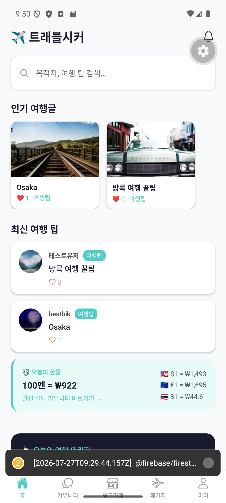

# 그래서 우리 앱의 무기는 뭐야?

이름도 새로 정하고, 커뮤니티·중고거래·패키지 기능도 웬만큼 갖췄다. 그런데 배포를 코앞에 두고 스스로에게 던진 질문 하나가 발목을 잡았다.

**"이 앱이 다른 여행 앱들과 다른 점이 뭐지?"**

솔직히 답이 궁색했다. 여행 커뮤니티도, 중고거래도, 패키지 예약도 이미 잘하는 서비스들이 있다. 기능 하나하나는 완성도 있게 만들었지만, "굳이 이 앱을 써야 할 이유"는 따로 없었다.

## 오래 묵혀둔 아이디어를 꺼내다

이 고민을 하면서 다시 떠올린 게 있었다. 1화에서 얘기했던, 애초에 이 앱을 만들게 된 계기 — **해외에서 겪었던 환전 수수료의 불편함**이었다.

은행에서 환전하면 수수료가 붙는다. 반면 여행자들끼리 직접 환전하면 그 수수료를 아낄 수 있다. 예를 들어 한국에서 일본으로 여행 가는 사람은 엔화가 필요하고, 반대로 일본에서 한국으로 오는 사람은 원화가 필요하다. 이 둘을 연결해주기만 해도 은행보다 저렴하게 환전할 수 있는 것이다.

지금 앱 홈 화면에는 이미 실시간 환율 정보가 떠 있다.

[스크린샷: 홈 화면 환율 배너]

지금까지는 이게 그냥 "참고 정보"였다. 여기서 한 걸음 더 나가서, **유저끼리 직접 환전을 매칭해주는 기능**을 이 앱의 핵심 차별점으로 삼기로 했다.

## 성장 순서를 다시 그리다

동시에 서비스를 어떤 순서로 키울지도 다시 정리했다.

1. **커뮤니티 먼저 키우기** — 사람이 모여야 나머지도 의미가 있다
2. **외화 직거래 매칭** — 무료로 사람을 모으는 핵심 기능
3. **중고거래 + 패키지** — 사람이 모인 다음 자연스럽게 붙는 수익
4. **광고 수익** — 마지막 확장 단계

이렇게 순서를 그리고 나니, 지금까지 만든 커뮤니티/중고거래/패키지 기능이 헛수고가 아니라 "2단계를 위한 밑작업"이었다는 게 명확해졌다.

## 아직 안 만든 것, 그리고 지켜야 할 선

지금 이 외화 직거래 기능은 아직 설계 단계다. 중고거래 화면의 구조(물건을 올리고, 채팅으로 협상하는 방식)를 그대로 가져다 쓰면 될 것 같다는 아이디어는 있지만, 실제 구현은 다음 단계로 남겨뒀다.

한 가지 분명히 정해둔 원칙이 있다. **앱은 "매칭"과 "채팅"까지만 담당하고, 실제 돈을 주고받는 건 앱 밖에서 이뤄지게 한다**는 것이다. 만약 앱이 직접 송금이나 환전을 중개하면 외국환거래법상 별도의 라이선스가 필요해질 수 있다. 그래서 이 앱은 어디까지나 "정보를 연결해주는 플랫폼"이라는 선을 분명히 긋기로 했다.

---

여기까지가 지금까지의 개발 과정이다. 코딩을 하나도 몰랐던 사람이, AI와 대화하면서 탭 5개짜리 빈 껍데기를 실제로 로그인되고 글이 써지고 채팅이 되는 앱으로 만들었다. 그리고 이제서야 "이 앱만의 진짜 이유"를 찾아가는 중이다.

다음 시리즈에서는 이 외화 직거래 기능을 실제로 만들어가는 과정을 이어서 기록해보려 한다. 코딩을 몰라도 아이디어 하나로 여기까지 올 수 있다는 걸 보여주고 싶었는데, 조금이라도 그 마음이 전해졌으면 좋겠다.

---

*(이전 화: [5화. 개명 이야기](./5화_개명_이야기.md))*
